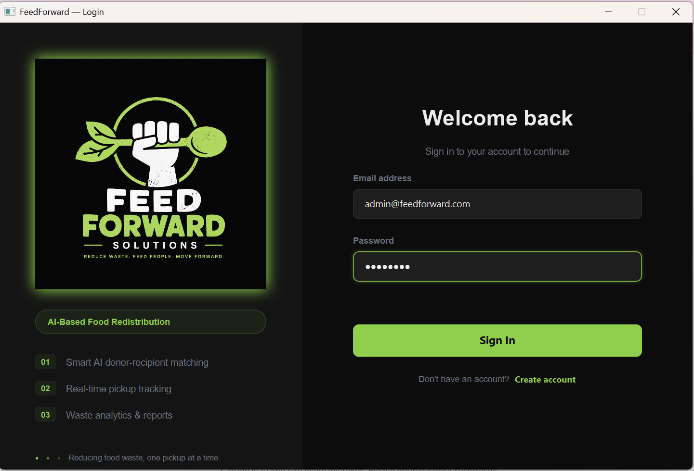
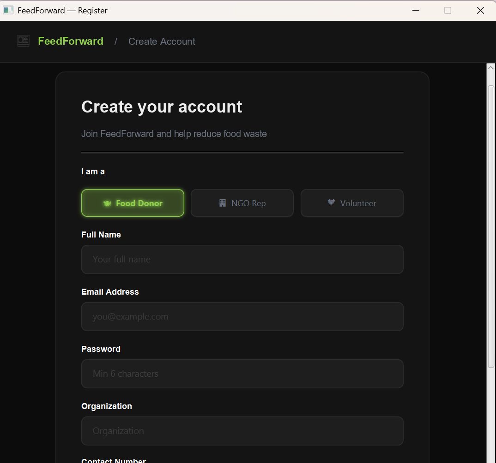
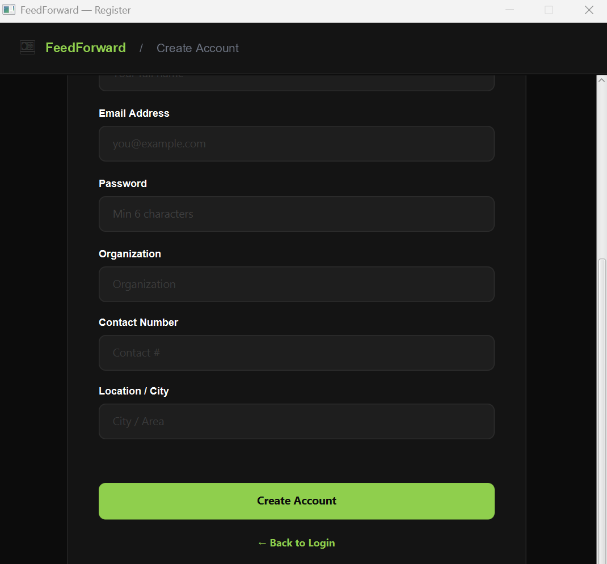
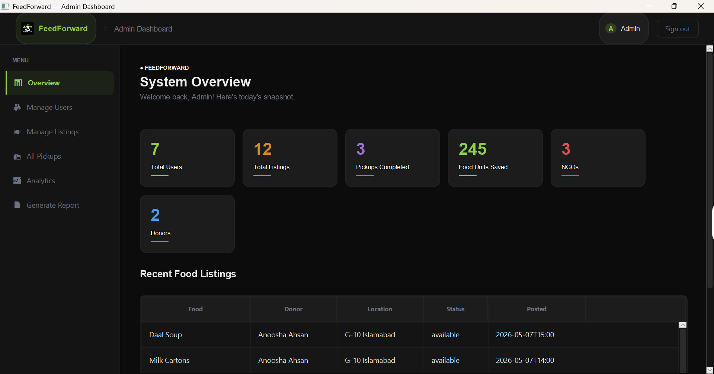

# 🍽️ FeedForward — Food Donation Management System

> A three-tier JavaFX desktop application that connects food donors with NGOs and volunteers to reduce food waste and fight hunger.


---

## 📌 Table of Contents

- [Overview](#overview)
- [Features & Use Cases](#features--use-cases)
- [Architecture](#architecture)
- [OOP & Design Patterns](#oop--design-patterns)
- [Screenshots](#screenshots)
- [Tech Stack](#tech-stack)
- [Getting Started](#getting-started)
- [Database Setup](#database-setup)
- [Project Structure](#project-structure)
- [Team](#team)

---

## Overview

**FeedForward** is a Software Design & Architecture (SDA) course project built as a fully functional 3-tier desktop application. It facilitates food donation management between three types of stakeholders — **Food Donors**, **NGO Representatives**, and **Volunteers** — overseen by an **Admin**.

The system automates the matching of surplus food listings to NGOs using an AI-matching algorithm based on location/service region proximity, schedules pickups, sends notifications, and generates analytics reports.

---

## Features & Use Cases

| # | Use Case | Role |
|---|----------|------|
| 1 | Register & Login | All Users |
| 2 | Create Food Listing | Food Donor |
| 3 | View & Manage Food Listings | Donor / Admin |
| 4 | AI-Based NGO Matching | System (auto-triggered) |
| 5 | View Matched Listings / Notifications | NGO Representative |
| 6 | Schedule Pickup | NGO Representative |
| 7 | View & Manage Pickups | Volunteer / Admin |
| 8 | Manage Users (Approve / Deactivate) | Admin |
| 9 | View Analytics Dashboard | Admin |
| 10 | Generate Reports | Admin |

---

## Architecture

The project follows a strict **3-Tier Architecture**:

```
┌─────────────────────────────────────┐
│         UI Layer (JavaFX)           │
│  LoginScreen, DonorDashboard,       │
│  NGODashboard, VolunteerDashboard,  │
│  AdminDashboard, UIComponents       │
└────────────────┬────────────────────┘
                 │
┌────────────────▼────────────────────┐
│      Business Logic Layer           │
│  UserService, FoodListingService,   │
│  AIMatchingService, PickupService,  │
│  AnalyticsService, SystemController │
└────────────────┬────────────────────┘
                 │
┌────────────────▼────────────────────┐
│         Database Layer (MySQL)      │
│  UserDAO, FoodListingDAO,           │
│  PickupDAO, NotificationDAO,        │
│  AnalyticsDAO, DBConnection         │
└─────────────────────────────────────┘
```

---

## OOP & Design Patterns

### OOP Principles Applied

- **Abstraction** — `User` is an abstract base class; `IMatchable`, `INotifiable`, `IReportable` are interfaces defining contracts
- **Inheritance** — `FoodDonor`, `NGORepresentative`, `Volunteer`, `Admin` all extend the abstract `User` class
- **Encapsulation** — All model fields are private/protected with public getters/setters
- **Polymorphism** — Roles are handled polymorphically through the `User` hierarchy

### Design Patterns

| Pattern | Where Applied |
|---------|--------------|
| **Singleton** (GoF) | `DBConnection` — single shared database connection |
| **DAO Pattern** | `UserDAO`, `FoodListingDAO`, `PickupDAO`, etc. — separates persistence from business logic |
| **Controller** (GRASP) | `SystemController` — central coordinator for cross-service operations |
| **Service Layer** | `UserService`, `FoodListingService`, `PickupService`, `AnalyticsService` — encapsulate business rules |
| **Session Object** | `Session` — tracks the currently logged-in user across screens |

---

## Screenshots

### Login & Registration
| Login Screen | Registration (Step 1) | Registration (Step 2) |
|---|---|---|
|  |  |  |

### Donor Portal
| Donor Dashboard | AI Matching |
|---|---|
|  |  |

### NGO Portal
| NGO Dashboard | Schedule Pickup |
|---|---|
|  |  |

### Volunteer Portal
| Volunteer Dashboard |
|---|
|  |

### Admin Portal
| Admin Dashboard | Food Listings | Pickups | Analytics | Reports |
|---|---|---|---|---|
|  |  |  |  |  |

---

## Tech Stack

| Layer | Technology |
|-------|-----------|
| Language | Java 21 |
| UI Framework | JavaFX 21.0.2 |
| Database | MySQL 8.0 (via XAMPP) |
| JDBC Driver | MySQL Connector/J 8.0.33 |
| Build Tool | Apache Maven |
| IDE | IntelliJ IDEA / Eclipse |

---

## Getting Started

### Prerequisites

- Java JDK 21+
- Apache Maven 3.8+
- XAMPP (MySQL) or standalone MySQL 8.0
- IntelliJ IDEA (recommended) or any Maven-compatible IDE

### Clone the Repository

```bash
git clone https://github.com/YOUR_USERNAME/feedforward.git
cd feedforward
```

### Build the Project

```bash
mvn clean install
```

### Run the Application

```bash
mvn javafx:run
```

---

## Database Setup

1. Start **XAMPP** and ensure **MySQL** is running on port `3306`
2. Open **phpMyAdmin** (or MySQL Workbench)
3. Create a new database named `feedforward`:
   ```sql
   CREATE DATABASE feedforward;
   ```
4. Import the provided schema file:
   ```bash
   mysql -u root -p feedforward < feedforward_schema.sql
   ```
5. The default connection uses:
   - **Host:** `localhost:3306`
   - **Database:** `feedforward`
   - **Username:** `root`
   - **Password:** *(empty)*

   > To change credentials, edit `src/main/java/com/feedforward/db/DBConnection.java`

---

## Project Structure

```
feedforward/
├── src/
│   └── main/
│       ├── java/com/feedforward/
│       │   ├── MainApp.java              # Entry point
│       │   ├── model/                    # Domain model (OOP layer)
│       │   │   ├── User.java             # Abstract base class
│       │   │   ├── FoodDonor.java
│       │   │   ├── NGORepresentative.java
│       │   │   ├── Volunteer.java
│       │   │   ├── Admin.java
│       │   │   ├── FoodListing.java
│       │   │   ├── PickupSchedule.java
│       │   │   ├── Notification.java
│       │   │   ├── Session.java
│       │   │   ├── IMatchable.java       # Interface
│       │   │   ├── INotifiable.java      # Interface
│       │   │   └── IReportable.java      # Interface
│       │   ├── business/                 # Business logic layer
│       │   │   ├── SystemController.java
│       │   │   ├── UserService.java
│       │   │   ├── FoodListingService.java
│       │   │   ├── AIMatchingService.java
│       │   │   ├── PickupService.java
│       │   │   └── AnalyticsService.java
│       │   ├── db/                       # Data access layer
│       │   │   ├── DBConnection.java     # Singleton
│       │   │   ├── UserDAO.java
│       │   │   ├── FoodListingDAO.java
│       │   │   ├── PickupDAO.java
│       │   │   ├── NotificationDAO.java
│       │   │   └── AnalyticsDAO.java
│       │   └── ui/                       # JavaFX UI layer
│       │       ├── LoginScreen.java
│       │       ├── RegisterScreen.java
│       │       ├── DonorDashboard.java
│       │       ├── NGODashboard.java
│       │       ├── VolunteerDashboard.java
│       │       ├── AdminDashboard.java
│       │       └── UIComponents.java
│       └── resources/
│           └── logo.png
├── Images/                               # UI screenshots
├── pom.xml                               # Maven build config
└── README.md
```

---

## Team

Developed as part of the **Software Design & Architecture (SDA)** course.

| Student ID | Name |
|------------|------|
| 24i-0527 | Haris Said |
| 24i-0547 | Hadia Nasir |
| 24i-0831 | Anoosha Ahsan |

---

## License

This project was developed for academic purposes at **FAST-NUCES**.
